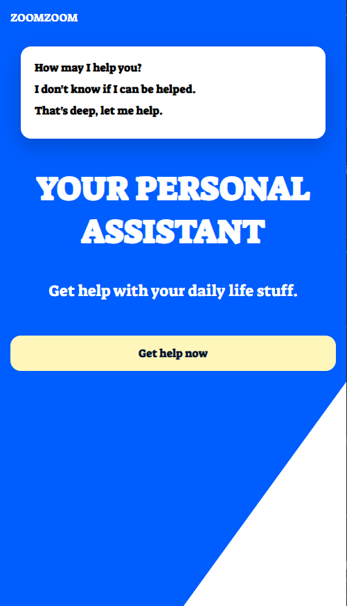

# Responsive template

This project results in a fun responsive HTML/SCSS template.

## Helpful VSCode extension

In Visual Studio Code, install install "Live Sass Compiler" - then "watch sass" in bottom of Visual Studio Code

## Helpful website resources

[https://caniuse.com](https://caniuse.com) - variables work 87% CSS3 browsers without needing sass

[https://bennettfeely.com/clippy/](https://bennettfeely.com/clippy/) - shape effects with CSS - polygons, octogons, rhombus, etc.

[https://developer.mozilla.org/en-US/docs/Web/CSS/CSS_Grid_Layout](https://developer.mozilla.org/en-US/docs/Web/CSS/CSS_Grid_Layout) - CSS3 Grid, is one of the best new things

## Screenshots

Desktop

Mobile

## Deployed application

### Website

[https://bravotango.github.io/Sassy/](https://bravotango.github.io/Sassy/)

### Repo

[https://github.com/bravotango/Sassy](https://github.com/bravotango/Sassy)
