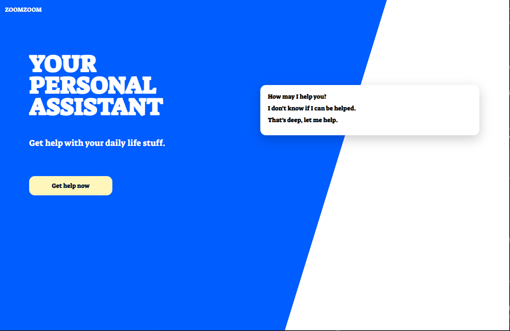

# Working with SCSS

This project results in a simple responsive HTML/SCSS template.

## A helpful VSCode extension

Instead of using Gulp to compile SASS into CSS install "Live Sass Compiler" - visual studio code
"watch sass" in bottom of visual studio code

## Resource websites

[https://caniuse.com](https://caniuse.com) - variables work 87% CSS3 browsers without needing sass

[https://bennettfeely.com/clippy/](https://bennettfeely.com/clippy/) - shape effects with CSS - polygons, octogons, rhombus, etc.

[https://developer.mozilla.org/en-US/docs/Web/CSS/CSS_Grid_Layout](https://developer.mozilla.org/en-US/docs/Web/CSS/CSS_Grid_Layout) - CSS3 Grid, is one of the best new things

## Screenshots

Desktop

Mobile

## Deployed application
